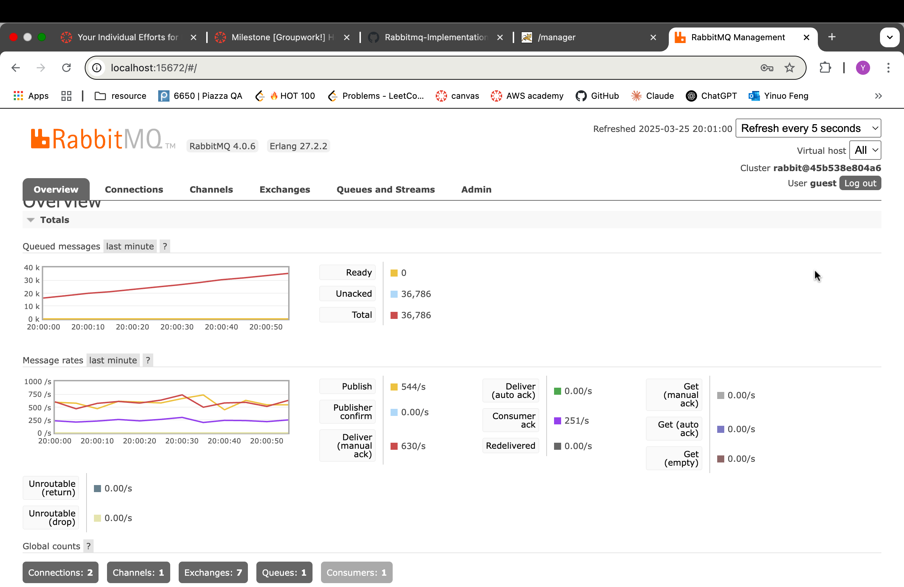
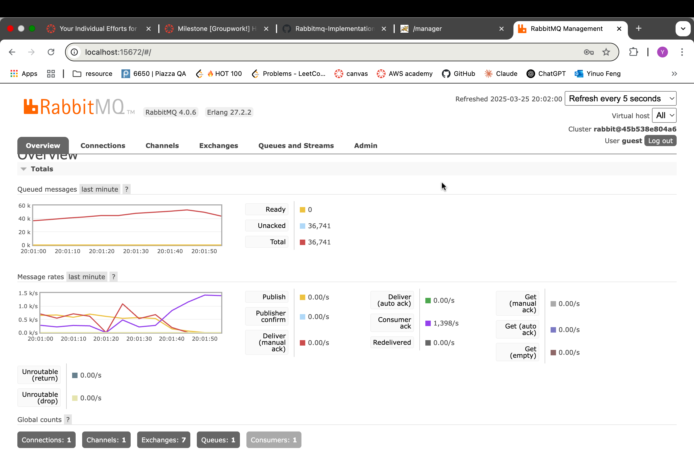
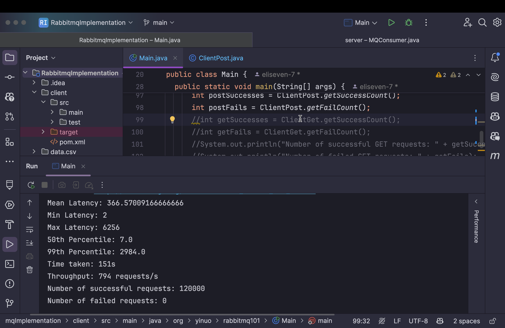

# Report

## Server Design

The main components include: 
1. Server.java (Java Servlets and producer side for RabbitMQ)
2. MQConsumer.java: (consumer side for RabbitMQ)
3. MySQL Database

On the server side, it handles income requests in three steps:
1. Handles HTTP requests with Servlets
2. Processes requests and forward important data to RabbitMQ
3. RabbitMQ sends mySQL queries to database

Message flow as in posting reviews:
1. Users submit a review on the client side (POST /review/{like|dislike}/{albumId})
2. Server receives the request, after processing the data, publishes the review message to RabbitMQ
3. RabbitMQ stores the message in likeQueue
4. MQConsumer reads the message and inserts it into the MySQL database

## Results

When client side is consistently sending requests, messages are piling in the queue.

After the client side ends, no more messages are coming into the queue, it is observed that consumer ack rate significantly rises.

The success rate is actually 79.29% after observing number of rows inserted into the database successfully. (95149 / 120000)

## Possible Bottleneck

1. The server establishes a new RabbitMQ connection every time it posts a review, which is very likely to cause overhead.
2. The request success rate remains 100%, suggesting that the system is not fully stressed and a potential bottleneck is not reached.
3. The throughput can be exaggerated for that message queue, as it's asynchronous, continues sending new queries to the database after the client side stops.
4. 
