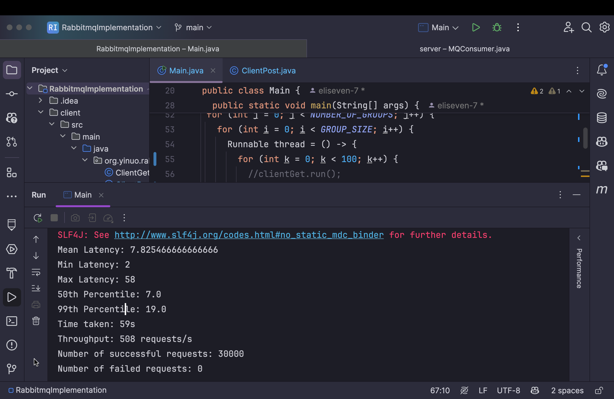

# Report

## Server Design

The main components include: 
1. Server.java (Java Servlets and producer side for RabbitMQ)
2. MQConsumer.java: (consumer side for RabbitMQ)
3. MySQL Database

On the server side, it handles income requests in three steps:
1. Handles HTTP requests with Servlets
2. Processes requests and forward important data to RabbitMQ
3. RabbitMQ sends mySQL queries to database

Message flow as in posting reviews:
1. Users submit a review on the client side (POST /review/{like|dislike}/{albumId})
2. Server receives the request, after processing the data, publishes the review message to RabbitMQ
3. RabbitMQ stores the message in likeQueue
4. MQConsumer reads the message and inserts it into the MySQL database

## Results

## Possible Bottleneck

The server establishes a new RabbitMQ connection every time it posts a review. 
